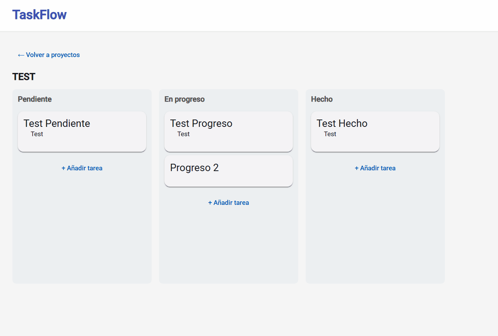

# TaskFlow



Fullstack task manager application built with ASP.NET Core 10, Entity Framework Core, Angular 22 and JWT Authentication.

## Tech Stack

**Backend**
- ASP.NET Core 10 Web API
- Entity Framework Core 10 (Code First, Migrations)
- SQL Server
- JWT Authentication
- REST API

**Frontend**
- Angular 22 (standalone components, signals)
- Angular Material
- Angular CDK Drag & Drop
- JWT interceptor + route guards

## Features

- User registration and login with JWT
- Create and manage projects
- Kanban board with three columns (Pending, In Progress, Done)
- Drag and drop tasks between columns with persistence
- Each user only sees their own data

## Architecture
Angular → HTTP + JWT → ASP.NET Core API → EF Core → SQL Server

## Getting Started

**Backend**
```bash
cd TaskFlow.API
dotnet restore
dotnet ef database update
dotnet run
```
API runs on `http://localhost:5188`
Scalar API docs available at `http://localhost:5188/scalar/v1`

**Frontend**
```bash
cd taskflow-client
npm install
ng serve
```
App runs on `http://localhost:4200`

## API Endpoints

| Method | Endpoint | Description | Auth |
|--------|----------|-------------|------|
| POST | /api/auth/register | Register user | No |
| POST | /api/auth/login | Login | No |
| GET | /api/project | Get my projects | Yes |
| POST | /api/project | Create project | Yes |
| DELETE | /api/project/{id} | Delete project | Yes |
| GET | /api/task/board/{projectId} | Get Kanban board | Yes |
| POST | /api/task | Create task | Yes |
| PUT | /api/task/{id}/move | Move task | Yes |
| DELETE | /api/task/{id} | Delete task | Yes |

## Author

Jorge Bermúdez Trillo — [LinkedIn](https://www.linkedin.com/in/jorge-bermúdez-trillo)
